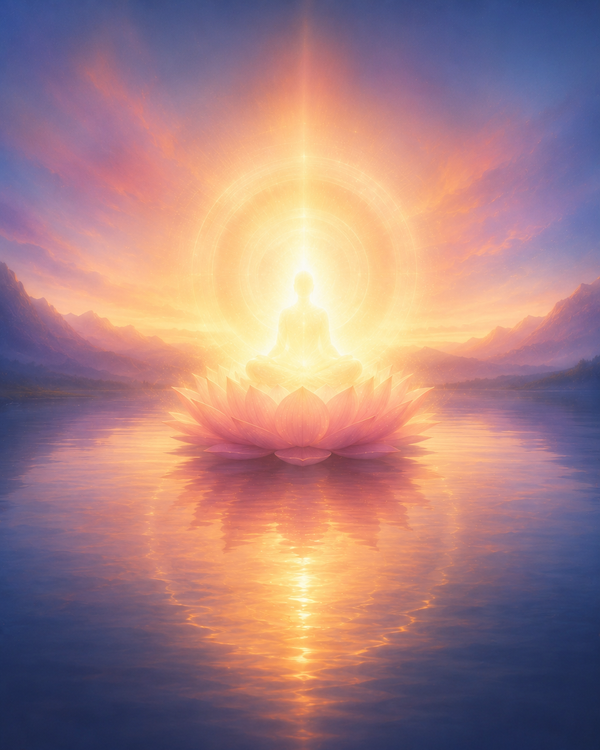

# Purification Exercise with Guru Rimpoche

From *Be Here Now* by Ram Dass

Consider a being of pure light and love (whom you can name
Padmasambhava, the Lotus-evolved One, if you would like), who is sitting in the
midst of a lake on a lotus flower in front of you. He is seen as being in front of
you and slightly above you . . . so that you look up to him at about a thirty
degree angle. He will come into your heart when you have sufficiently purified
yourself.
1. Closing your left nostril, breathe three deep breaths out of your right nostril.
Visualize the air being ejected as dark red and consider it to be all of your bodily
diseases and attachments.
2. Close your right nostril. Now breathe out three deep breaths through your
left nostril. Visualize the air being ejected as a blue-grey and consider it to be all
your mental obstacles and anger.
3. Now breathe out three deep breaths through your mouth. Visualize this air
as purple and consider it as the sloth that impedes your progress . . . the inertia
. . . breathe it out.
4. Now visualize that from the ajna (the point between the eyebrows) of
Padmasambhava directly to your ajna there is a piercing beam of white light
which, as it burns into you, rids you of bodily sins and wrongs (the sound
connected with this is OM).
5. Now visualize a red beam from the throat chakra (point of energy) of
Padmasambhava directly to your throat center. This beam rids you of lapses of
speech, of untruths (the sound connected with this is AH).
6. Now visualize a blue beam of light coming from the heart of
Padmasambhava to your heart. This beam purifies you of wrongs done in
ignorance, wrong thoughts (i.e., thoughts which maintain the illusion). (The
sound associated with this beam is HUM.) 7. Now allow that blue beam to
become a broad blue avenue of light. Then you will see Padmasambhava come
down that avenue and come directly into your heart. Here he will sit in your
hridayam (spiritual heart). His mantra is: Om Ah Hum Vajra Guru Padma Siddhi
Hum. This means three-in-one (the unmanifest, imminent manifestation, and
manifestation) lightning-bolt Guru of unbearable compassion and infinite power
who resides in my heart. To say his mantra is to keep Him in your heart . . . until
finally you and He become One.